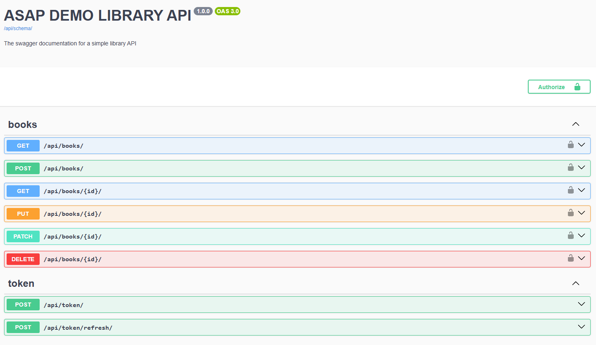

# TT_Asap_demo_library

This project is a simple **Library Management API** built using **Django REST Framework** and **PostgreSQL**. It supports complete CRUD operations for Books, along with other features.

## Features

- **JWT** authentication
- **Admin** role for **mutations** operations (create, update, delete)
- **Default** role for **read** operations (retrieve, list)
- **Pagination** 10 books per page (/api/books/)
- **Filtering** with query parameters (/api/books/?author=...&published_date=...&language=...)
- **Swagger** basic API documentation (/api/schema/swagger/)

## Installation (Docker, Local):

1. Clone the repository
    ```bash
    git clone https://github.com/panicua/TT_Asap_demo_library.git
    ```

2. Create an `.env` file in the root of the project directory. You can use the `.env.example` file as a template. Don't forget to replace the placeholders with your own values:
   ```sh
   cd TT_Asap_demo_library
   cp .env.example .env
   ```

3. Build docker image and start containers (**tests** and **migrations** are already included in docker-compose.yml):
   ```sh
   docker-compose build
   docker-compose up
   ```

#### I also prefilled db with sample_data.json (you can remove it from docker-compose.yml if you don't need it), you can use those credentials:
- **admin_user**. username: admin, password: admin

## SwaggerDEMO:

